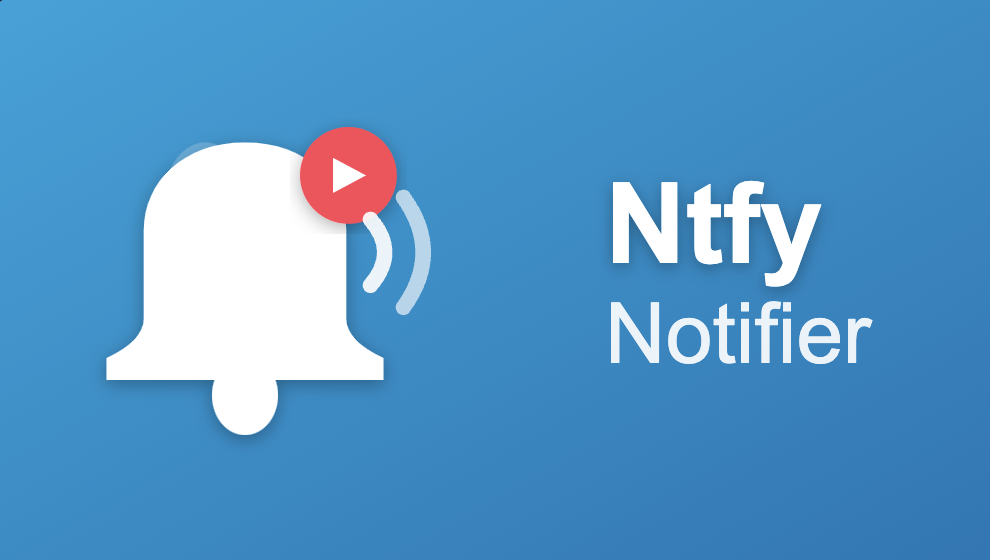

<div align="center">



# Jellyfin Ntfy Notifier

**Get instant notifications when new media is added to your Jellyfin library**

[](https://opensource.org/licenses/MIT)
[](https://jellyfin.org/)

Send push notifications to your devices using [ntfy.sh](https://ntfy.sh) whenever movies, TV shows, or music are added to Jellyfin.

</div>

---

## Installation

1. Open **Jellyfin Dashboard** → **Plugins** → **Repositories**
2. Add repository URL:
   ```
   https://raw.githubusercontent.com/aG00Dtime/Jellyfin.Plugin.NtfyNotifier/main/manifest.json
   ```
3. Go to **Catalog**, find **Ntfy Notifier**, and install
4. Restart Jellyfin

## Configuration

**Dashboard** → **Plugins** → **Ntfy Notifier**

| Setting | Description |
|---------|-------------|
| **Ntfy Server** | `https://ntfy.sh` or your own server |
| **Topic** | Your unique topic name |
| **Access Token** | Optional, for private topics |

Enable the media types you want (Movies, TV, Music) and click **Send Test Notification** to verify.

## Subscribe to Notifications

- **Web**: https://ntfy.sh/your-topic
- **Mobile**: Download the ntfy app ([iOS](https://apps.apple.com/app/ntfy/id1625396347) / [Android](https://play.google.com/store/apps/details?id=io.heckel.ntfy))

## Custom Formats

Customize your notification messages with format strings:

**Movies**: `{title} ({year})`  
**Episodes**: `{series} - S{season:00}E{episode:00}: {name}`  
**Music**: `{track} - {artist}`

Available placeholders: `{title}`, `{year}`, `{series}`, `{season}`, `{episode}`, `{name}`, `{track}`, `{artist}`, `{album}`

## License

MIT License - see [LICENSE](LICENSE) file for details.

---

<div align="center">

Made for the Jellyfin community

</div>
